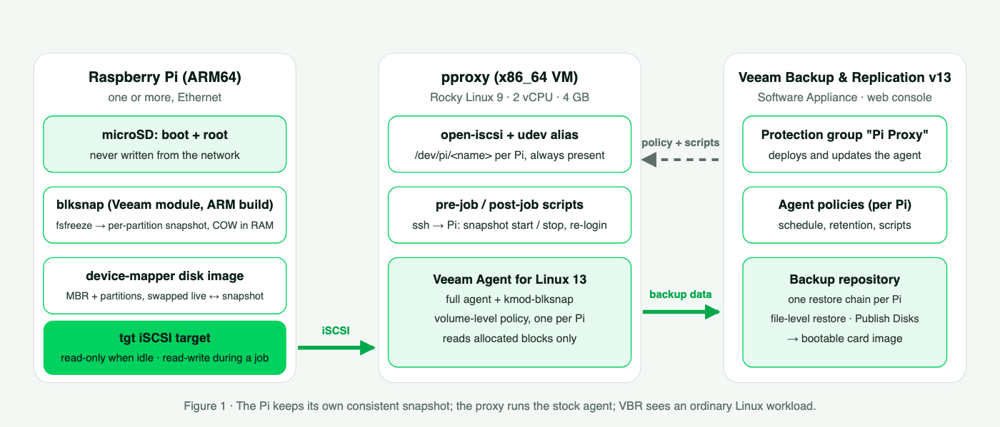

# pi-veeam-proxy

> ### ✦ Deploy it with Claude Code
> Don't want to do the Linux side by hand? **[DEPLOY-WITH-CLAUDE.md](DEPLOY-WITH-CLAUDE.md)** has a
> ready-made prompt: clone this repo, open it in [Claude Code](https://claude.com/claude-code), paste the
> prompt, and Claude will ask for your addresses, help you set up SSH, install and verify the proxy and
> every Pi, prepare the files for your Veeam server, and walk you through the Veeam web console.

Back up Raspberry Pi (ARM64) boards with **Veeam Backup & Replication v13** by presenting a frozen,
point-in-time image of each Pi's SD card over iSCSI to a small x86 "proxy" VM that runs the stock
Veeam Agent for Linux. Veeam sees an ordinary Linux volume; the Pi's live card is never writable
from the network.

Full write-up: `docs/Backing-Up-Raspberry-Pi-with-Veeam.pdf` (also published as a blog post).
Design notes and the reasoning behind every non-obvious choice: `docs/DESIGN.md`.
Every command, per host: `docs/COMMANDS.md`.

> Community project, not a supported Veeam configuration. Test in a lab first.

## Layout
- `pi/` — Pi side: `install.sh` (tgt, DKMS build of Veeam's blksnap with the ARM64 patch, blksnap CLI,
  export service), `pi-veeam-export.sh` (idle / start / stop / status / down), the systemd unit, the patch.
- `proxy/` — proxy side: `pi-attach.sh` / `pi-detach.sh`, `pi-add-target.sh` (register a Pi),
  `pi-job-pre.sh` / `pi-job-post.sh` (the hooks the agent runs), `pi-make-wrappers.sh` and `per-policy/`
  (the 2-line wrappers that live on the backup server), `99-pi-veeam.rules` (udev
  alias `/dev/pi/<name>`), the attach timer, and the restore tooling `pi-rebuild-image.sh` /
  `pi-fit-image.sh`.
- `docs/` — design, commands, one `sfdisk -d` dump per Pi (needed for bare-metal restore).

## Quick start
1. Proxy (Rocky/RHEL 9 VM, static IP): install `iscsi-initiator-utils`, copy `proxy/*` into place
   (see `docs/COMMANDS.md`), enable `pi-veeam-attach.timer`.
2. Each Pi (Raspberry Pi OS 64-bit, static IP or DHCP reservation, Ethernet): `sudo pi/install.sh <proxy-ip>`.
3. Proxy: `pi-add-target.sh <pi-ip> <pi-hostname> <ssh-user>` and a `/etc/pi-veeam/targets.d/<pi-hostname>` line.
4. VBR web console: protection group with the proxy (SSH credential, full agent, not nosnap); one
   **agent policy** per Pi, volume-level, object `/dev/pi/<pi-hostname>`, job scripts = the two
   wrappers for that Pi placed on the backup server; Apply Configuration; run.
5. Restore: file-level from the console; bare metal via Publish Disks → `pi-rebuild-image.sh` →
   `pi-fit-image.sh` → write the image to a card.

Names in this repo (`pi-01`, `pi-02`, `pproxy`, `vbr01.lab.local`, `10.10.0.x`) are the lab's
sanitized examples; substitute your own.

## License
MIT — see `LICENSE`.
